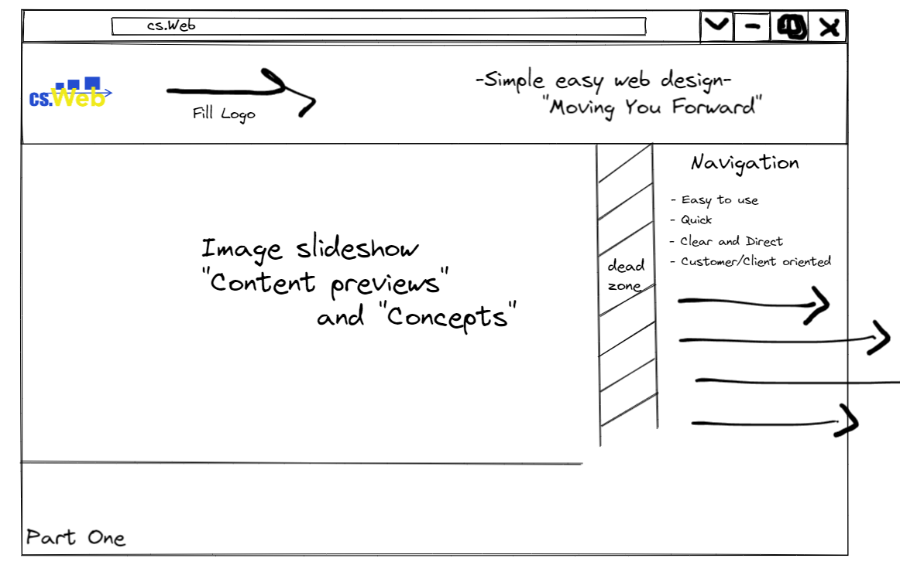
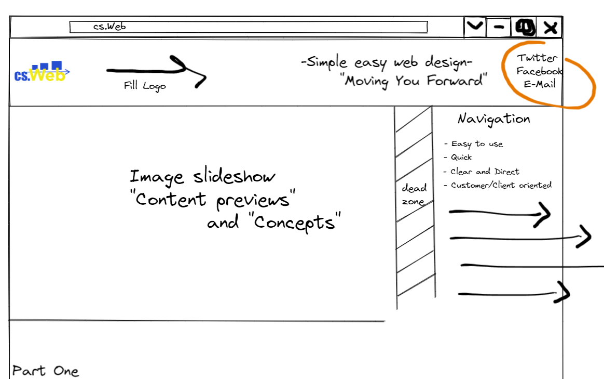

# cs.Web

## **Our Goal:**

Welcome to _**cs.Web**_! We aim to provide high quality customer service focused web design and development, in addition to new products we offer long term maintaince and upkeep with a friendly and local approach. Our goal is to provide an initial and longterm experience for customers that makes them feel connected, ingaged, and invested in their respective applications. We plan to acheive these objectives through regular customer contact on a monthly basis, prioritized updates, customer input and feedback. In addition to monthly contact with customers we provide ready assistance for any issues or requests and provide solutions in a resonable time respective to the project as well as updated analitics and data for existing applications.

### **Company Goals**

- As a growing small buisness our Goal is to provide Quality Web Design using a Customer First Idioligy focusing on customer needs including Product Developement, Refactoring, Online Presence, and Logo Developement. We plan to acheive these Goals by working directly with customers and developing a Clear Direction, Branding, and Product Representation. In addition we will provide High Quality Products focused on our customers given Feedback and Direction through ample Customer Contact and Status Updates.

### **Company Values**

- Provide Quality Customer Care and Service.
- Provide Personable and Intuitive Customer Contact focused on the Customers Goals first.
- Local Simple Web Design.

  

## **Initial Concepts**

#

- Email, Facebook, Twitter, linkedin anchors

